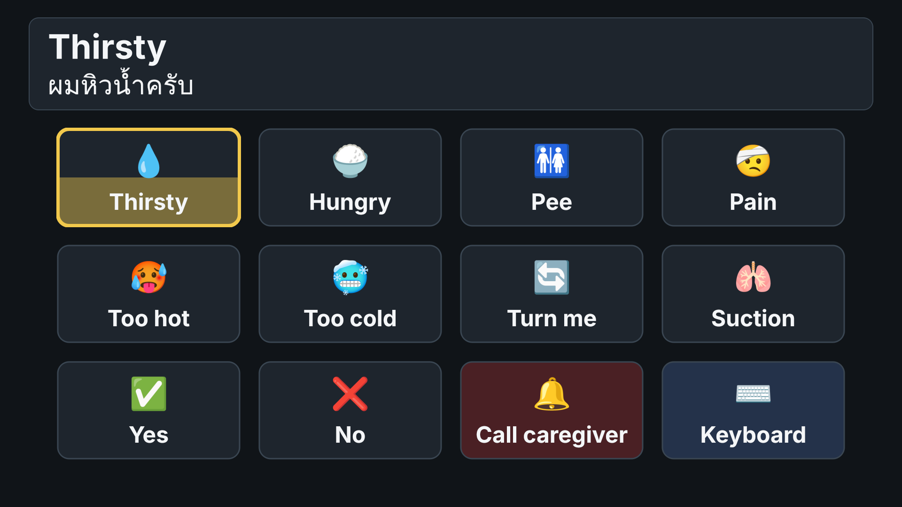
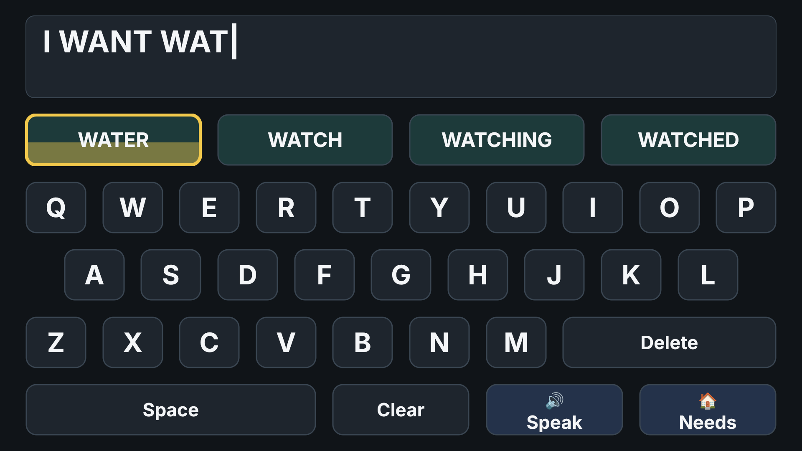
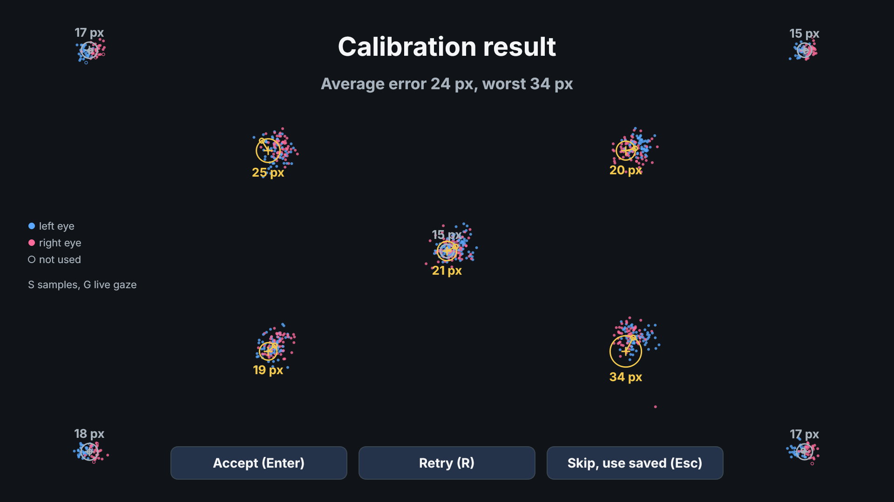
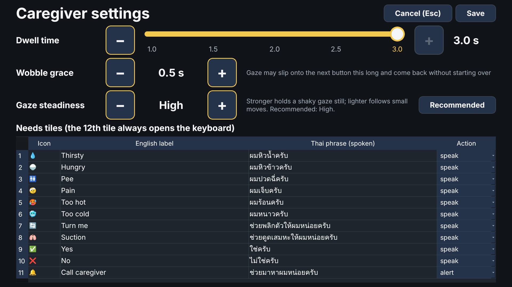
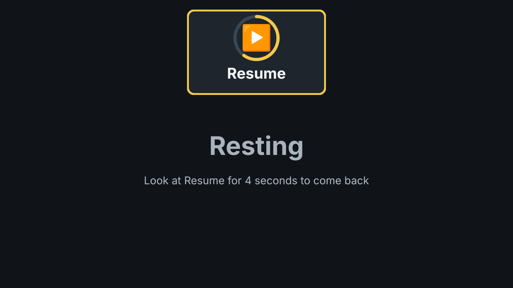

# Commu-Aid-EyeTrack

A full-screen communication aid for a person with ALS, driven by a Tobii Pro Spark eye tracker.
The patient looks at a button for a set time (3 seconds by default, adjustable from 1 to 3 s
in 0.5 s steps) to choose it. The app shows the English text and speaks it in Thai.

- **Page 1, Needs:** 11 large tiles (Thirsty, Hungry, Pee, Pain, Too hot, Too cold, Turn me,
  Suction, Yes, No, Call caregiver) and a Keyboard tile. Each tile speaks a fixed Thai phrase.
  Call caregiver also plays a loud alarm.
- **Page 2, Keyboard:** a number row above the QWERTY letters, with Space after M. Tall Yes and No
  buttons down the left speak "ใช่" / "ไม่ใช่" at once and leave the typed text alone; a tall Delete
  and Clear sit down the right. Six word buttons above the numbers predict the word being typed
  (or the next word); choosing one finishes the word and adds a space. Prediction is offline and
  learns from every message the patient speaks.
  Speak and Needs sit at the top beside Pause. Speak translates the typed English to Thai offline
  (Meta NLLB-200) and speaks the Thai.
- **Calibration** runs every time the app starts: position check, 9-point calibration (corners,
  edge middles and centre; a point with bad data is shown once more), 9-point validation out to
  the edge buttons, then Accept or Retry. The position check draws a face
  outline that follows the patient's head (bigger when closer, tilted with the eyes) over a dashed
  outline of where it should be. The live gaze is drawn
  throughout, and the result plots every gaze sample collected at each point, per eye.
- **Edges:** buttons keep clear of the left, right and bottom screen edges, where the tracker is
  least accurate, and gaze that lands just past a button still counts for it. Gaze in the margin
  outside all the buttons counts for the nearest edge button. The miss measured at each
  validation dot becomes an **edge correction** that is taken out of the live gaze.
- **Pause (top right)** rests the screen while the patient watches TV or talks: every button
  turns off except one large **Resume** button at the top centre, which needs a longer look
  (4 s by default, `pause.resume_dwell_s`) and fills a ring as it counts. F4 pauses and resumes too.
- **Settings (F3)** let the caregiver change the dwell time (1 to 3 s, in 0.5 s steps, with a large
  slider and big − / + buttons), switch the edge correction on or off, and edit the Needs tiles.
  A small line at the bottom of the Needs and Keyboard pages reminds the nurse of F2 (recalibrate)
  and F3 (Settings), with fn on a Mac.

| Needs | Keyboard |
| --- | --- |
|  |  |
| **Calibration** | **Settings** |
|  |  |
| **Resting (Pause)** | |
|  | |

The design and decisions are in the
[design proposal](https://claude.ai/code/artifact/2b4e4611-b66c-4974-8125-2c922de159a4).

## Install on a Mac (the app)

This is everything a new Mac needs to run Communication Aid from the installer, without Python.
Do the steps in order; each is needed once per Mac. You need the `.dmg` built as in
[Build the installer](#build-the-installer), a Mac login with administrator rights, and
internet for the downloads.

1. **Install the app.** Open `CommunicationAid-<version>-<chip>.dmg` and drag
   **Communication Aid** onto **Applications**. The app only runs on the same chip as the Mac
   that built it: built on Apple silicon (M1 to M4), it needs an Apple silicon Mac.
2. **Allow it to open.** It isn't signed by Apple, so macOS blocks it the first time:
   1. Double-click **Communication Aid** in Applications. When macOS says it can't be opened,
      click **Done**.
   2. Open **System Settings > Privacy & Security**, scroll down to "Communication Aid was
      blocked" and click **Open Anyway**. Enter the Mac password if asked.
   3. Open the app again and click **Open Anyway**. Quit it for now (Cmd+Q).

   If there is no Open Anyway button, run
   `xattr -dr com.apple.quarantine "/Applications/Communication Aid.app"` in Terminal instead.
3. **Install Rosetta (Apple silicon Macs only).** Tobii's driver is an Intel program, so it needs
   Rosetta. In Terminal:

   ```bash
   softwareupdate --install-rosetta --agree-to-license
   ```

4. **Install the Tobii Pro Spark driver.** Follow
   [Install the Tobii Pro Spark driver](#install-the-tobii-pro-spark-driver-runtime) below:
   download the runtime from Tobii Connect, double-click **install-driver**, type the Mac
   password, wait for `Runtime Service 2.2.3.0 Installed`. Then plug the Spark straight into
   the Mac (no hub), or unplug and replug it.
5. **Install Tobii Pro Eye Tracker Manager.** Download it for macOS from
   [Tobii Pro Eye Tracker Manager](https://www.tobii.com/products/software/applications-and-developer-kits/tobii-pro-eye-tracker-manager),
   open the download and drag it to Applications, then open it (allow it in Privacy & Security
   if macOS asks). The Spark should appear in its list. If it doesn't, the driver in step 4 isn't
   running yet: unplug and replug the Spark, or restart the Mac. Ignore its own driver Install
   button if it is greyed out; step 4 replaces it.
6. **Run Display Setup.** In Eye Tracker Manager, click the Spark, then **Display Setup**. Enter
   the size of the screen the Spark is mounted on (measure the visible picture in millimetres)
   and where the Spark sits under it, then save. Do this again whenever the Spark moves to a
   different screen. A wrong size makes gaze miss more and more towards the screen edges.
7. **Add the Thai voice.** System Settings > Accessibility > Spoken Content > System Voice >
   Manage Voices, find Thai and add **Kanya**.
8. **Start Communication Aid.** Calibration runs first: the patient follows the dots, then press
   Enter to accept or R to retry. On the first start the translation model downloads (about
   2.5 GB), so keep the Mac online for a few minutes; the first Speak waits for it.

If the app can't find the Spark, it says why: click **Show Details** for the full check, or
choose **Use the mouse** to try the app without it. To run the same check from Terminal:

```bash
"/Applications/Communication Aid.app/Contents/MacOS/Communication Aid" --check-tracker
```

Settings, the saved calibration and `app.log` are in the hidden folder `~/.commu_aid`
(Finder: Go > Go to Folder, `~/.commu_aid`). Send `app.log` with any problem report.

To uninstall, quit the app and drag it from Applications to the Bin. To remove its settings
and the translation model too:

```bash
rm -rf ~/.commu_aid ~/.cache/huggingface/hub/models--facebook--nllb-200-distilled-600M
```

The Tobii driver and Eye Tracker Manager stay installed.

### Build the installer

On the development Mac, with the environment from [Setup](#setup-macos):

```bash
conda activate commu-aid
packaging/mac/build_mac.sh      # makes dist/CommunicationAid-<version>-<chip>.dmg
```

Send the `.dmg` by AirDrop, USB stick or a shared drive. Rebuild after pulling new changes, so the
installer has them. Options (`--version`, `--no-translate`, signing) are in
[docs/install-mac.md](docs/install-mac.md).

## Setup (macOS)

`tobii-research` only ships wheels for **Python 3.10**, so the environment must use exactly
that version.

### With conda (terminal)

From the project folder:

```bash
conda env create -f environment.yml   # Python 3.10 + every requirement, including Tobii and translation
conda activate commu-aid
```

[`environment.yml`](environment.yml) installs the app, the Tobii SDK, the offline translation
packages (PyTorch is large, so this step takes a while) and pytest. After you pull new code
that changes a `requirements*.txt` file, update the environment with:

```bash
conda env update -f environment.yml --prune
```

To start again from scratch: `conda env remove -n commu-aid`, then create it again.

### With conda in VS Code

1. Install the **Python** extension (it includes the debugger).
2. Open the project folder in VS Code.
3. Press Cmd+Shift+P, choose **Python: Select Interpreter**, and pick **commu-aid**
   (create the environment in a terminal first, as above).
4. Open a new terminal (Terminal > New Terminal): it activates `commu-aid` for you.
   Run the app there with the commands under [Run](#run).
5. Or open **Run and Debug** (Cmd+Shift+D), pick one of the configurations in
   [`.vscode/launch.json`](.vscode/launch.json), and press F5:
   - Communication Aid (mouse, windowed)
   - Communication Aid (Tobii Pro Spark)
   - Communication Aid (calibration demo with mouse)
   - Communication Aid (simulated eye tracker)
6. The tests show up in the **Testing** panel (the flask icon).

If VS Code's terminal still shows `(base)`, run `conda activate commu-aid` in it once.

### Without conda (uv or venv)

```bash
uv venv -p 3.10 .venv
source .venv/bin/activate

uv pip install -r requirements.txt          # app
uv pip install -r requirements-tobii.txt    # eye tracker
uv pip install -r requirements-translate.txt  # offline translation (large: torch + 2.5 GB model)
```

### One-time setup on the Mac

#### Install the Tobii Pro Spark driver (runtime)

The Tobii SDK can't see the Spark until Tobii's Spark runtime is installed. Eye Tracker
Manager's own driver installer (+ > Tobii Pro Spark > Install) only supports macOS 13 and 14,
so on newer macOS its Install button stays greyed out. Install the runtime directly instead:

1. Sign in at [connect.tobii.com/s/spark-downloads](https://connect.tobii.com/s/spark-downloads)
   ("Tobii Pro Spark downloads") and click **Download** under **macOS**. You get
   `TobiiProSpark_2.2.3.0_x64.dmg` (version 2.2.3.0 is the one tested here).
2. Open the `.dmg` and double-click **install-driver**. A Terminal window opens.
   If macOS blocks it, go to System Settings > Privacy & Security, scroll down and click
   **Open Anyway**.
3. At `Password:` type your Mac login password (nothing shows while you type) and press Return.
4. Wait for:

   ```text
   I: Installing platform_runtime_IS5LPROENTRY_MAC_x64_service to /Library/Application Support/Tobii/PlatformRuntimes
   I: Installing com.tobii.pdk.runtime.IS5LPROENTRY.plist to /Library/LaunchDaemons
   I: Starting com.tobii.pdk.runtime.IS5LPROENTRY.plist
   Runtime Service 2.2.3.0 Installed
   ```

   then close the Terminal window when it says `[Process completed]`.
5. Plug the Spark straight into the Mac (Tobii's USB-C to USB-A adapter is fine). If it was
   already plugged in, unplug it, wait a few seconds and plug it back in.
6. Check that the SDK finds it:

   ```bash
   conda activate commu-aid
   python -m commu_aid.check_tracker
   ```

   It should print a line like `Tracker     Tobii Pro Spark  serial TPE01-...`. With the Mac
   app instead of Python, run
   `"/Applications/Communication Aid.app/Contents/MacOS/Communication Aid" --check-tracker`.

Don't commit the `.dmg` to this repo: it is Tobii's software, so download it from Tobii Connect
on each Mac.

#### Display, Thai voice and translation

Once only, in **Tobii Pro Eye Tracker Manager**, run Display Setup so the tracker knows the
monitor's size and position. The app's layout is fixed at 1920x1080.

For the Thai voice: System Settings > Accessibility > Spoken Content > System Voice >
Manage Voices, and add **Kanya** (Thai).

The first time Speak is used, the translation model downloads from Hugging Face
(about 2.5 GB) and is cached after that, so the first run needs internet.

### If the app says "No Tobii eye tracker found"

Run the checker in Terminal (with `conda activate commu-aid`):

```bash
python -m commu_aid.check_tracker
```

It shows whether the Mac sees the tracker on USB and whether the Tobii SDK finds it. Then:

1. Plug the Spark's own USB-A cable straight into the Mac, using Tobii's USB-C to USB-A adapter
   if the Mac only has USB-C. Hubs, docks and monitor USB ports often can't supply the power
   spikes the tracker needs. Unplug, wait a few seconds, plug back in.
2. If macOS asks whether to allow the accessory to connect, choose **Allow**.
3. Open **Tobii Pro Eye Tracker Manager**. If the Spark isn't listed, press **+** (top right) to
   install its driver, then unplug and replug the tracker.
4. If Install is greyed out, install the Spark runtime directly as described in
   [Install the Tobii Pro Spark driver](#install-the-tobii-pro-spark-driver-runtime). If the
   tracker still isn't found, restart the Mac. On an Apple silicon Mac, also make sure Rosetta is
   installed (`softwareupdate --install-rosetta --agree-to-license`), since the runtime service
   is an Intel build.
5. Once the driver is installed, the checker should list the Spark.

### If gaze misses near the screen edges

Some error is normal (the gaze dot sits a little off), but if it grows towards the edges, work
through these in order, recalibrating (F2) after each change:

1. **Display Setup.** Run `python -m commu_aid.check_tracker`. It compares the screen size the
   tracker was set up for with the real screen and warns when they differ. If they do, open
   Tobii Pro Eye Tracker Manager > Display Setup, enter this screen's size and where the Spark
   is mounted, and save. A wrong size gives exactly this pattern: good in the middle, worse
   and worse towards the edges. The calibration result screen says so too ("Gaze lands outside
   every dot") when every miss points away from (or towards) the centre.
2. **Distance and angle.** The Spark works from about 45 to 95 cm; aim for 60 to 70 cm, with
   both eyes in the middle of the position box. Tilt the screen so it faces the patient's
   eyes; the tracker must look up at the eyes, not at the chin or forehead. The bottom
   corners are hardest, because the eyelids partly cover the eyes when looking down.
3. **Light and glasses.** Avoid sunlight or a bright lamp behind the patient or shining into
   the tracker. Glasses can reflect the tracker's light; tilt them slightly or try without.
4. **Read the result screen.** Each circle is how far off the gaze was at that dot, and the
   line shows which way it missed. Lines all pointing the same way mean an offset (position);
   lines all pointing outward or inward mean Display Setup.

What is left after that, the app corrects itself. The 9 validation dots reach the outermost
buttons (Pause at the top, the edge keys at the sides and bottom). Where the gaze landed at each
dot is turned into a smooth shift that the main screen takes out of every gaze sample
(on by default; each shift is capped at 250 px). The caregiver can switch it off and on with the
**Edge correction** button on the Settings page (F3); every calibration learns it either way, so
switching takes effect at once without recalibrating (`calibration.edge_correction` in `config.yaml`). It works best
when the patient's head stays still after calibrating, because the miss then stays the same.
The result screen says "Edge correction on" and how far it moves the gaze, and the live gaze dot
there is already corrected: ask the patient to look at a few edge dots again and check the dot
now lands on them before pressing Accept. The correction is saved beside the calibration
(`~/.commu_aid/calibration.edge.json`) and used again when the calibration is skipped.

The layout helps too: `side_margin_px` and `bottom_margin_px` in `config.yaml` keep buttons
away from the edges (the keys stay at least 110 px), `snap_px` lets gaze in a gap or just
past the edge count for the nearest button, and `edge_snap_px` (150 px) lets gaze anywhere in the
margin outside all the buttons count for the nearest edge button (not on the rest screen, so a
glance away does not wake it). Raising the margins further makes the keys smaller, so fix
Display Setup and position first.

To try the edge correction without the tracker, `python -m commu_aid --simulate edges
--calibration-demo --windowed` adds an error that grows towards the sides and bottom; follow the
validation dots with the mouse.

## Run

From the project folder, with the environment active (`conda activate commu-aid`):

```bash
python -m commu_aid                      # Tobii Pro Spark, calibration at start-up
python -m commu_aid --mouse --windowed   # no tracker: the mouse stands in for gaze
python -m commu_aid --mouse --calibration-demo   # rehearse the calibration screen with the mouse
python -m commu_aid --simulate --windowed        # simulated eye tracker (see below)
python -m commu_aid --skip-calibration   # use the last saved calibration
python -m commu_aid.check_tracker        # check the tracker without starting the app
python -m commu_aid --config other.yaml  # use a different settings file
python -m commu_aid -v                   # verbose logging
python -m commu_aid --check-tracker      # same as python -m commu_aid.check_tracker
```

### Simulated eye tracker

`--simulate` still follows the mouse, but makes it behave like real gaze from the Pro Spark:
the point shakes all the time, sits a little off target and slowly drifts, holds still on small
movements and jumps on large ones, drops out on blinks (about 15 a minute) and on short losses
of tracking, and now and then gives a wild sample. Use it to try dwell time, blink grace and
cooldown settings before the tracker is available.

```bash
python -m commu_aid --simulate --windowed          # typical bedside conditions
python -m commu_aid --simulate mild --windowed     # close to the tracker's specification
python -m commu_aid --simulate hard --windowed     # tired patient, glasses, poor light
python -m commu_aid --simulate edges --windowed    # typical, plus error growing towards the sides and bottom
python -m commu_aid --simulate --sim-seed 1        # repeat the same jitter and blinks every run
python -m commu_aid --simulate --calibration-demo  # with the pretend calibration screen
```

Press Ctrl+G to see the gaze dot. The levels are defined in
[`commu_aid/gaze/simulated_source.py`](commu_aid/gaze/simulated_source.py).

Caregiver keys:

| Key | Action |
| --- | --- |
| F2 | Calibrate again |
| F3 | Settings (dwell time, edge correction, Needs tiles) |
| F4 | Pause or resume |
| Ctrl+G (Cmd+G on a Mac) | Show or hide the gaze dot |
| F11 | Full screen on or off |
| Ctrl+Q (Cmd+Q on a Mac) | Quit |

On a Mac keyboard, hold **fn** to use F2, F3, F4 and F11.

A caregiver can also fix the message box from the keyboard. Letters, numbers and Space type
into it (from the Needs page this opens the keyboard page), Backspace deletes one character,
Shift+Backspace clears the box and Enter speaks it. These keys do nothing while calibration,
Settings or the rest screen is showing.

On the calibration screen: **Space** starts, **Enter** accepts, **R** retries, **Esc** skips and
uses the saved calibration, **G** shows or hides the live gaze, and **S** shows or hides the gaze
samples on the result screen. The live gaze is unfiltered, so it shows what the tracker reports;
if the patient follows the dot instead of the target, press **G** (or set
`calibration.show_live_gaze: false`).

The result screen plots every gaze sample behind each point: blue for the left eye, pink for the
right, hollow for samples the tracker left out of the calibration. A tight cluster off the dot is
an offset; a wide cloud is noise; one eye's cluster away from the other's points at that eye.

## Settings

Everything is in [`config.yaml`](config.yaml):

- `dwell`: dwell time, blink grace, cooldown.
- `gaze_filter`: how the gaze point is steadied (see [If the gaze point is shaky](#if-the-gaze-point-is-shaky)).
- `display`: edge margins and snapping (see [If gaze misses near the screen edges](#if-gaze-misses-near-the-screen-edges)).
- `calibration`: for example `auto_accept_max_error_px` to accept a good calibration without
  pressing Enter, `redo_point_px` to set when a calibration point is collected again,
  `show_live_gaze`, and `edge_correction` (also on the Settings page).
- `pause`: `resume_dwell_s`, how long the patient must look at Resume to leave the rest screen.
- `needs`, `translation`, `speech`: the Needs tiles and their Thai phrases, translation, voices.
The Thai phrases should be checked by a Thai speaker; they use the male form (ผม ... ครับ).

### If the gaze point is shaky

Even a well-calibrated tracker reports a point that shakes by tens of pixels while the eyes hold
still. The `gaze_filter` section of `config.yaml` steadies it. The default, `method: fixation`,
works the way eyes move: they hold still on a button, then jump to the next one. While the
samples stay within `fixation_radius_px` of the current point, the point is their average, so
it barely moves; when `confirm_samples` samples in a row land somewhere new, it jumps straight
there. A single wild sample never moves it.

Compared on the simulated tracker (`--simulate`, 60 Hz), with the old 5-sample moving average:

| Level | Shake while looking at a button (RMS) | Time for the point to reach a new button |
| --- | --- | --- |
| mild | 7.7 px → 8.6 px | 67 ms → 33 ms |
| typical | 17.9 px → 12.0 px | 67 ms → 33 ms |
| hard | 37.3 px → 24.4 px | 67 ms → 33 ms |

The default `fixation_radius_px: 120` is set for noisy gaze. Keep it below 146 px, the distance
between neighbouring button centres. With a steady tracker, 80 holds the point closer to slow
drift (6.1 px at mild, 10.2 px at typical, 28.9 px at hard). If the point feels sticky, lower
it or `confirm_samples`.
`method: one_euro` is a speed-adaptive low-pass filter, and `method: average` brings back the
old moving average. Press Ctrl+G to watch the dot while you try them.

The app writes to `~/.commu_aid/`: the saved calibration, generated sounds, and
`messages.log` (every message with a time stamp), and `words.json` (the words and word pairs
the patient has spoken, used to rank predictions; delete it to start fresh). The Mac app also
keeps its `config.yaml` and `app.log` there.

## How it works

```text
Tobii Pro Spark ─▶ Gaze source ─▶ Edge correction ─▶ Gaze filter ─▶ Targets ─▶ Dwell engine ─▶ UI pages ─▶ Speech
 (tobii_research    (or mouse,    (from the 9        (combine eyes,  (which    (1-3 s timer,   (Needs,
  60 Hz)             simulated)    validation dots)   fixation        button,   grace,          Keyboard,
                                                      filter)         snapping) cooldown)       Pause)
```

| File | Role |
| --- | --- |
| `commu_aid/main.py` | Command-line options, picks the gaze source, starts the app |
| `commu_aid/check_tracker.py` | Tracker checker: Python and SDK versions, USB, Display Setup size |
| `commu_aid/config.py` | Loads and saves `config.yaml` |
| `commu_aid/gaze/tobii_source.py` | Tobii SDK: gaze stream, user position, calibration |
| `commu_aid/gaze/mouse_source.py` | Mouse as fake gaze for development |
| `commu_aid/gaze/simulated_source.py` | Simulated tracker: mouse plus jitter, offset, blinks, dropouts |
| `commu_aid/gaze/filters.py` | Combine both eyes; gaze filters (fixation, One Euro, moving average) |
| `commu_aid/gaze/correction.py` | Edge correction learned from the validation dots |
| `commu_aid/dwell.py` | Dwell state machine (no UI code, unit tested) |
| `commu_aid/targets.py` | Which button the gaze is on, with snapping to the nearest one |
| `commu_aid/ui/main_window.py` | Full-screen window, gaze loop, page switching |
| `commu_aid/ui/pages.py` | Needs and Keyboard layouts, word prediction row |
| `commu_aid/ui/dwell_button.py` | Button that fills up while it is looked at |
| `commu_aid/ui/message_bar.py` | English and Thai text shown at the top |
| `commu_aid/ui/gaze_dot.py` | Gaze dot overlay (Ctrl+G) |
| `commu_aid/ui/pause_screen.py` | Rest screen with the long-dwell Resume button |
| `commu_aid/ui/calibration.py` | Start-up calibration: position check with face outline, live gaze, result plots |
| `commu_aid/ui/settings.py` | Caregiver settings (dwell slider in 0.5 s steps, Needs tiles) |
| `commu_aid/predict.py` | Offline word prediction (10,000 common words, care words, learning) |
| `commu_aid/data/` | Word lists for prediction (`english_words.txt`, `care_words.txt`) |
| `commu_aid/speech.py` | Offline text-to-speech (`say` on macOS, pyttsx3 elsewhere) |
| `commu_aid/sounds.py` | Click and caregiver-alarm sounds, generated on first run |
| `commu_aid/translate.py` | Offline English to Thai with NLLB-200 |
| `packaging/mac/` | Mac app and `.dmg` installer build ([docs/install-mac.md](docs/install-mac.md)) |

Dwell rules: a selection fires after the dwell time on one button; a blink or glance away
shorter than 0.3 s does not reset the timer; after a selection, nothing can be selected for
1 s and the same button stays inert until the patient looks away, so one long stare never
types "AAAA" or bounces between pages.

## Tests

```bash
python -m pytest        # in the activated commu-aid environment (pytest comes with environment.yml)
```

The tests cover the dwell engine with scripted gaze streams, the gaze filters, the simulated
eye tracker (jitter, offset, drift, blinks, dropouts, repeatable seeds), word prediction, config loading and saving, and the whole window driven by a scripted gaze source (choosing a need,
the alarm, typing and speaking, word prediction, translation failure, page switching, settings
and the 0.5 s dwell steps, edge margins and snapping, the edge correction, pause and resume),
button targeting and layout, the edge correction (on simulated edge error it cuts the median miss
at the edge buttons from about 115 to 30 px), the tracker checker, and the calibration screen
(collecting bad points again, spotting a Display Setup problem, keeping every gaze sample per
eye, the live gaze, learning the edge correction).
